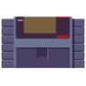
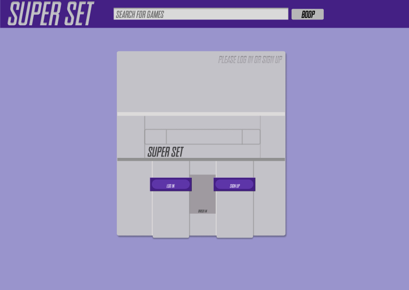
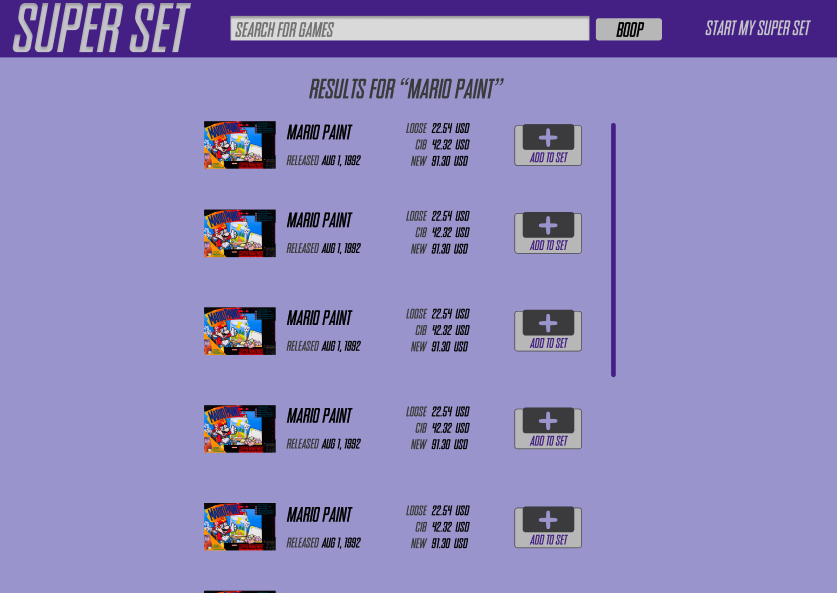
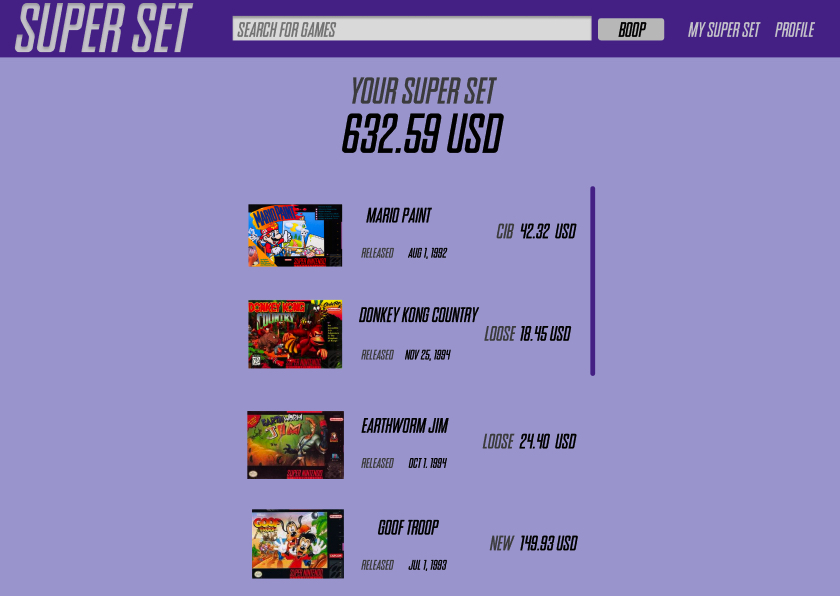

#  Super Set 

Welcome to Super Set, the new home of you Super Nintendo (SNES) collection. The inspiration behind the site was a lack there of, there are few collectors sites for specific platforms, and none of them are great to look at. Super Set is designed to pull collectors in, taking its color scheme directly from the console itself, it’s sure to hit a few nostalgic heart strings. Already packed with features, and many more to come soon! So, stop on over and power-up your collection with Super Set

## User Stories
- As a visitor, I want to browse games 
- As a visitor, I want to see a games details and description
- As a logged-in user, I want to add games I own to my "Super Set"
- As a logged-in user, i want to remove game i no longer own

## Wireframes
For full wireframes, please look [here](https://www.figma.com/file/vWFQ1KsLPvftmLREwZgpF1/Super-Set?node-id=0%3A1)

## Technologies Used
For Soul Sip'n we used many different technologies.
- Postgres
- Express
- React
- Node.js
- SASS

## Coming Soon - Future Development
- As a visitor, I want to see current game pricing
- As a visitor, i want to be able to search for a game
- As a logged-in user, I want to the total worth of my set
- As a logged-in user, I want to the current price of each game in my set

## Special Thanks To...
Without these people, the app would not be where it is today!

Instructors and TAs
- Brock Whitbread-Cole
- James Sinkler
- Michael Petty
- Jacob Kleiman
- Uyen Lam 
- Seanny Phoenix

Supportive Classmates
- Lauren Nguyen
- Jane Cho
- Jamie Cabrigas
- Ashley Nguyen
- Kelsey Whallon
- Lucy Franco
- Tess Bishop
- Casey Jenkins
- Mario Carbonell

and lastly
- Cake, for providing the soundtrack to this project